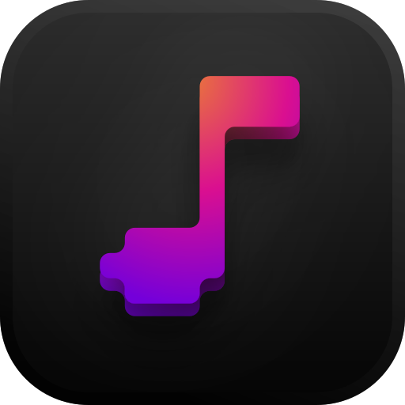

  
  <h1 align='center'><b>Symphony</b></h1>
  
Let's create something amazing.

  
  
Languages: 

  
  
,

  
  
,

  

  
Frameworks:

  
  
+

  
  
served via

  
  
and

  
  
|

  

  
Assets:

  
  

## Overview: *Monorepo*

**[Symphony](https://powerscore.vercel.app/)** is a music creation software for people of all skill levels. With a strong focus on **intuitive design**, Symphony takes away the usual learning curve that makes many creatives shy away from conventional tools. For drawing up a simple musical idea, conventional DAWs are *far too complex*, requiring lengthy project setups, and catering to high-power users, which can clutter the interface for simple experimentative sessions. *Symphony* aims to provide that space where users can **jump right in and start drafting**, keeping the user experience simple yet powerful.

When you're ready to move on to the more technical phase, *Symphony* gives you power features like **multi-track sound** or **various instruments**, and to **export** into audio formats (.mp3, .flac, .wav) or ***convert** into standard music file types (.midi, .musicxml), where you can continue your jam session.

## Codebase Information

*Symphony* is made with a pretty custom stack - Originally I used:
- React + Vite (for PM frontend)
- Electron (for full app and packaging)
- Node (for file CRUD ops and IPC)
- Python (with a self-made Pygame-based UI library I dubbed EventGame, and the Mixer library for audio)

However, I found areas of bloat (full app sat at over 250MB, installer ZIP was almost 1 GB due to redundancies) that I heavily gutted out in later versions. The latest version has a more layered - but in-practice a *leaner* - stack, hovering at around ~ 65 MB for a full build.

- Tauri (for full app, launch shell, and packaging)
- React + Vite (for PM frontend)
- Pywebview (for PM backend)
- Python (for ALL system ops - CRUD and project state)
- EventGame + Pygame.Mixer (like before)

> This essentially removes Node and Electron from the stack, reducing disk size and RAM usage, and all-python backend means developer velocity is still fast. The thin Tauri shell is simply for a static launch pane, and for handling the NSIS/DMG installer simply.

<!--  -->

## Design

Symphony has a clean, consistent UI design language we're calling Slate. It features a dark, yet contrast-rich look with plenty of design flair, while adhering to strict principles of design.
### Typeface Choice

There are **two** major fonts used across Symphony: *Instrument Sans*, and *Inter*.

- ***Instrument Sans*** is recognizable by its slightly wide stance, smaller natural kerning, and low x-height. This makes it great for big titles, where legibility is not an issue. It also has a touch of character, with features like the tilted terminals visible in letters like the lowercase 't', without being too bold or hard to read.

- ***Inter*** is characterized by its simplicity, sacrificing uniqueness for legibility. It's designed to be readable at even tiny sizes, with very high x-height and consistent minimum internal spacing to avoid clashing. As both the project manager and editor feature text at small sizes throughout, Inter was a clear choice.

### Button Design
Across the system, we have buttons that accomplish different tasks, from small, single-step actions that are stateless, to heavier tasks that advance UX flow in some way, all the way up to huge actions that move the program to a completely different state. To communicate each of these three abilities, we have a design language built into the buttons.

- **Standard Buttons** can be seen in the toolbar or in left and right panels. They are often stateless (but not always), and don't command user attention, since if all such buttons were bold, they would be fighting for attention.
- **Heavy Buttons** can be seen in modals, often reading "Next" or "Done" or "Delete". These perform big actions, including closing the modal itself, and need to distinguish themselves from the rest of the options on the modal.
- **Call-to-Action** is used in the "Open in Editor" button. This is a special button as it launches a whole separate window, and represents the program state changing. This button style is used incredibly sparingly (so far, only once) as it is very commanding of attention.

### Continued Intent
On top of our extensive button design considerations, we also need to work practicality into design aesthetics. While plain text is great at describing the purpose of a button, practically it is impossible to give text to every button on the screen. In areas like the toolbar, we use icons instead. Here, we are trading initial affordance with better space usage. But to keep users from having to guess what buttons do, we employ hover tooltips on all icon-only buttons, and for any text fields where internal text is truncated for space. This ensures that all navigational information is accessible, even if not visible at once.

This is also closely aligned with a more global design ideology we follow in Symphony, **continued intent**. This is the idea that an action should suggest the actions that follow it, like creating a symphony -> opening created symphony or exporting -> highlighting exported file. Tooltips, which came before continued intent was formalized, is now a subset of the larger design framework.

### Directing Attention
Symphony has many *modals*. These are floating widgets that display task-sensitive information, and require the user's immediate attention. To direct the user's attention to the content of the modals, in a manner that does not clutter their view, we employ a subtle blur to everything else.

### Optical Spacing
A common example used to explain optical sizing is the [circles and squares example.](https://bjango.com/articles/opticaladjustments/) In *Symphony* (and many other softwares) a more common optical sizing problem is seen: large and small text. A common misconception is that all left or right-justified text should align to the same pixel -- however, this will lead to the smallest text feeling pushed further to the edge than the larger text, since more of its details are optically closer to the edge. We must shift smaller text away from the edge to keep them feeling optically aligned.

As you can see in the above example, the red line is several pixels to the right of the blue line, however the text is **optically aligned;** without the lines pointing it out, the text actually appears more natural than if they were pixel-aligned. Additionally, the image shows the effect of optical kerning as well -- the percentage of letter widths that is proportional to the empty space *increases* as the text gets smaller. This keeps text feeling breathable at all sizes. In *Symphony*, this can be seen in the small letterforms in the toolbar, where wide kerning allows the text to remain readable even at < 9px.

## *Footnote:* Technical Challenges & Future Considerations

### Development Velocity vs Performance

As a solo project, it was imperative that development velocity is preserved, due to limited manpower. However, overly prioritizing velocity can lead to incredibly heavy and bloated apps, creating installation and usage friction. It has been an ongoing effort to combat bloat while keeping the stack simple - some key moments where the balance tipped both ways include:

- pre-v1.0: choosing Python as the primary language in the app was a decision massively favoring dev velocity. However, with heavy usage of C libraries for sound generation, performance was kept in check. Now, core functionalities are written in Python that are staples in the app, it is now a non-negotiable that Python is in the stack.

- v1.0: choosing Electron as the app runtime over Tauri was in an effort to ensure PM development was fast, at the expense of large RAM usage. Electron was a mature, extremely easy-to-use framework that made an MVP project manager even possible.

- v1.1: rebuilding the core editor from the old monofile architecture, while creating a more object-oriented frontend structure, was a large upfront cost in dev velocity - but with the goal of enabling faster editor development down the line, and simultaneously making the UI more performant. This was a crucial inflection point from MVP to stable product.

- v1.1.5: migrating Electron/Node to Pywebview + a thin Tauri shell was a calculated effort to shrink app footprint and RAM usage (overall "heaviness") while achieving parity in dev velocity. While pywebview is less mature than Electron, it has opened the floodgates to creating new features faster, and existing features more performant.

- v1.2 and beyond: unlocked by v1.1.5, a potential rewrite of the UI in the Editor to also use web frameworks via pywebview could make UX upkeep far easier. This itself would be a massive unlock for more complex UX in the editor, including instruments, plugins, and more.